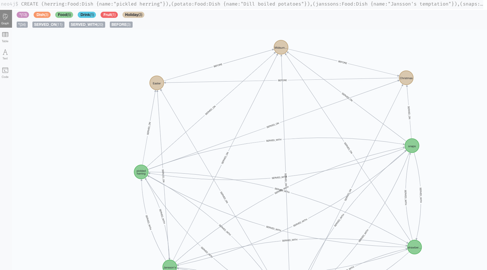

= Connecting Swedish major holidays and food
:toc:

In Sweden, the Midsummer week is the most important time other than Christmas. According to my colleagues, if we’re not allowed to take the time off, a revolution will arise with snaps and pickled herrings in the air.

Friday is Swedish Midsummer Eve. While people are dancing The Little Frogs dance around a maypole (see the following image), I can’t help noticing the main food is pickled herring and potatoes once again. Just the same as other major holidays like Christmas and Easter.

How are Swedish major holidays are connected to food in the world of data?

[#img-little-frogs-dance]
.People dancing The Little Frogs (Source: Wikipedia entry The Little Frogs (Swedish: Små grodorna))
image::https://upload.wikimedia.org/wikipedia/commons/thumb/2/28/%C3%85rsn%C3%A4s%2C_Midsummer_of_69_%283%29.JPG/640px-%C3%85rsn%C3%A4s%2C_Midsummer_of_69_%283%29.JPG[People dancing The Little Frogs dance around a maypole on a Swedish Midsummer celebration.]

== Visualising the data model

A graph data model visualizes things and connects them through their relationships. Things are data entities of a dataset.

A graph data model is represented by the following:

* Data entities are represented by nodes and labels.
* Nodes are connected through relationships. Nodes and relationships can be further defined by properties.

For information about nodes, labels, properties, and relationships, see https://neo4j.com/developer/guide-data-modeling/[Neo4j Data modeling guidelines].

To visualize Swedish major holidays and food in a graph data model, essentially we need to identify the things and their relationships before connecting them all together. Let’s follow these steps:

. xref:_step_1_choose_things_and_define_a_data_set[Choose things and define a dataset].
. xref:_step_2_identify_data_entities_and_define_nodes[Identify data entities and define nodes].
. xref:_step_3_identify_data_categories_and_define_labels[Identify data categories and define labels].
. xref:_step_4_identify_and_define_relationships_[Identify and define relationships].
. xref:_step_5_connecting_all_together[Connect all together and form a data model].

=== Step 1: Choose things and define a dataset

Swedish major holidays includes:

* Christmas
* Easter
* Midsummer

The following food are commonly served on those holidays:

* Dill boiled potatoes
* Jansson’s temptation (A creamy potato and fish gratin)
* Pickled herrings
* Snaps
* Strawberries

The holidays and food are defined as a dataset to be modeled.

=== Step 2: Identify data entities and define nodes

Each holiday and food of the defined dataset is a data entity:

* Christmas
* Easter
* Midsummer
* Dill boiled potatoes
* Jansson’s temptation (A creamy potato and fish gratin)
* Pickled herrings
* Snaps
* Strawberries

The data entities are defined as nodes in the graph data model. See <<image-nodes>>.

[#image-nodes]
.Nodes
image::images/nodes.svg[The major holidays and food are defined as nodes.]

=== Step 3: Identify data categories and define labels

The dataset can be categorized into the following groups:

* Holiday
* Food
    ** Dish
    ** Drink
* Fruit
* Food

The categories are defined as labels in the graph data model. See <<image-nodes-with-labels>>.

[#image-nodes-with-labels]
.Nodes with labels
image::images/nodes-labels.svg[Node added with labels]

=== Step 4: Identify and define relationships

The nodes are connected through the following relationships:

* Holidays happen one before another:
    ** Easter happens before Midsummer
    ** Midsummer happens before Christmas
    ** Christmas happens before Easter
* Food and drink are served on a holiday:
    ** Easter: Pickled herrings, dill boiled potatoes, Jansson’s temptation
    ** Midsummer: the same as Easter with addition of snaps
    ** Christmas: the same as Midsummer except strawberries
* Food and drink are served with each other on a holiday:
    ** Easter: Pickled herrings, dill boiled potatoes, Jansson’s temptation
    ** Midsummer: the same as Easter with addition of snaps
    ** Christmas: the same as Midsummer except strawberries

The relationships are defined in the graph data model.

=== Step 5: Connecting all together

By connecting all the nodes and labels through the relationships, the data model is visualized. See <<image-data-model-visualization>>.

In the data model, Midsummer is before Christmas. In Midsummer, people mainly eat pickled herrings, dill boiled potatoes, Jansson’s temptation, strawberries, and drink snaps.

[#image-data-model-visualization]
.Data model
image::/images/visualization-swedish-major-holidays-and-food.svg[In the visualized data, all the nodes and labels are connected through the relation ships.]

== Creating the data model in Neo4j

Cypher is a graph query language for querying the Neo4j database.

To create the data model in Neo4j database, run Cyper queries based on the visualized data model, as in the following example queries.

.Click to see the example queries
[%collapsible]
====
[source,cypher]
----
CREATE (herring:Food:Dish {name:"pickled herring"}),(potato:Food:Dish {name:"Dill boiled potatoes"}),(janssons:Food:Dish {name:"Jansson's temptation"}),(snaps:Food:Drink {name:"snaps"}),(strawberry:Food:Fruit {name:"strawberries"})
CREATE (easter:Holiday {name:"Easter"}),(midsummer:Holiday {name:"Midsummer"}),(christmas:Holiday {name:"Christmas"})
CREATE (herring)-[:SERVED_WITH]->(potato)-[:SERVED_WITH]->(herring)
CREATE (potato)-[:SERVED_WITH]->(janssons)-[:SERVED_WITH]->(potato)
CREATE (janssons)-[:SERVED_WITH]->(snaps)-[:SERVED_WITH]->(janssons)
CREATE (herring)-[:SERVED_WITH]->(janssons)-[:SERVED_WITH]->(herring)
CREATE (herring)-[:SERVED_WITH]->(snaps)-[:SERVED_WITH]->(herring)
CREATE (potato)-[:SERVED_WITH]->(snaps)-[:SERVED_WITH]->(potato)
CREATE (strawberry)-[:SERVED_WITH]->(snaps)-[:SERVED_WITH]->(strawberry)
CREATE (strawberry)-[:SERVED_WITH]->(janssons)-[:SERVED_WITH]->(strawberry)
CREATE (strawberry)-[:SERVED_WITH]->(herring)-[:SERVED_WITH]->(strawberry)
CREATE (strawberry)-[:SERVED_WITH]->(potato)-[:SERVED_WITH]->(strawberry)
CREATE (herring)-[:SERVED_ON]->(easter)
CREATE (herring)-[:SERVED_ON]->(midsummer)
CREATE (herring)-[:SERVED_ON]->(christmas)
CREATE (potato)-[:SERVED_ON]->(easter)
CREATE (potato)-[:SERVED_ON]->(midsummer)
CREATE (potato)-[:SERVED_ON]->(christmas)
CREATE (janssons)-[:SERVED_ON]->(easter)
CREATE (janssons)-[:SERVED_ON]->(midsummer)
CREATE (jassons)-[:SERVED_ON]->(christmas)
CREATE (snaps)-[:SERVED_ON]->(midsummer)
CREATE (snaps)-[:SERVED_ON]->(christmas)
CREATE (strawberry)-[:SERVED_ON]->(midsummer)
CREATE (easter)-[:BEFORE]->(midsummer)-[:BEFORE]->(christmas)-[:BEFORE]->(easter)
RETURN herring, potato, janssons, snaps, strawberry, easter, midsummer, christmas
----
====

The example queries create a graph data model, as shown in <<image-example-graph-data-mode-in-neo4j>>.

[#image-example-graph-data-mode-in-neo4j]
.Example graph data model in Neo4j

== Using the data model

The graph data model of Swedish major holidays and food is also known as a knowledge graph. A knowledge graph represents knowledge about a specific domain. In this case, the culture domain about Swedish holidays and good.

An an example, such a data model might be used by a chatbot to find answers to the following questions.

=== What Swedish food is common for Midsummer, Christmas, and Easter?

.Cypher query
[source,cypher]
----
MATCH (food:Food) WHERE (food)-[:SERVED_ON]->(:Holiday {name: "Midsummer"}) AND (food)-[:SERVED_ON]->(:Holiday {name: "Easter"}) AND (food)-[:SERVED_ON]->(:Holiday {name: "Christmas"})
RETURN DISTINCT food
----

Answer: Dill boiled potatoes and pickled herrings.

=== What’s the typical food for Midsummer?

.Cypher query
[source,cypher]
----
MATCH (food:Food) WHERE (food)-[:SERVED_ON]->(:Holiday {name: "Midsummer"})
RETURN DISTINCT food
----

Answer: Dill boiled potatoes, Jansson’s temptation, pickled herrings, snaps, and strawberries.

=== When do Swedes eat pickled herrings with snaps?

.Cypher query
[source,cypher]
----
MATCH (holiday:Holiday) WHERE (holiday)<-[:SERVED_ON]-(:Drink {name: "snaps"})-[:SERVED_WITH]->(:Dish {name: "pickled herring"})
RETURN DISTINCT holiday
----

Answer: Midsummer and Christmas.