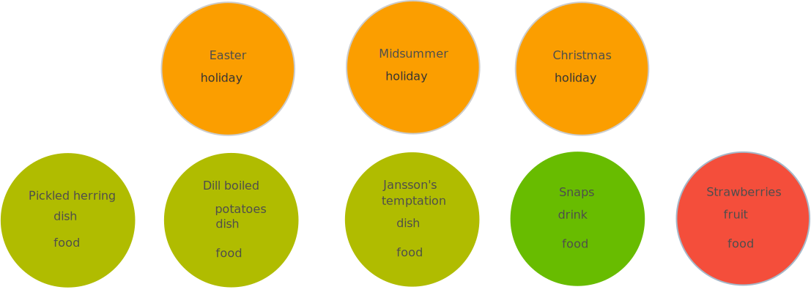

= Data modeling Swedish major holidays and food
:toc:

In Sweden, the Midsummer week is the most important time other than Christmas. Anecdotally speaking, if people are not allowed to take the time off, a revolution will arise with snaps and pickled herring in the air.

Friday is Swedish Midsummer Eve. While people are dancing The Little Frogs dance around a maypole (see the following image), the main food is pickled herring and potatoes once again. Just the same as other major holidays like Christmas and Easter.

[#img-little-frogs-dance]
.People dancing The Little Frogs (Source: Wikipedia entry The Little Frogs (Swedish: Små grodorna))
image::https://upload.wikimedia.org/wikipedia/commons/thumb/2/28/%C3%85rsn%C3%A4s%2C_Midsummer_of_69_%283%29.JPG/640px-%C3%85rsn%C3%A4s%2C_Midsummer_of_69_%283%29.JPG[People dancing The Little Frogs dance around a maypole on a Swedish Midsummer celebration.]

How are Swedish major holidays are connected to food in the world of data, you might wonder?

The following steps will help you find out the connection.

== Visualizing the data model

A graph data model visualizes things and connects them through their relationships. Things can be seen as data entities of a dataset.

A graph data model is represented by the following:

* Data entities are represented by nodes and labels.
* Nodes are connected through relationships. Nodes and relationships can be further defined by properties.

To know more about nodes, labels, properties, and relationships, see https://neo4j.com/developer/guide-data-modeling/[Neo4j Data modeling guidelines].

To visualize Swedish major holidays and food in a graph data model, essentially you need to identify the things and their relationships before connecting them all together

=== Step 1: Choose things and define a dataset

Swedish major holidays includes:

* Christmas
* Easter
* Midsummer

The following food are commonly served on those holidays:

* Dill boiled potatoes
* Jansson’s temptation (A creamy potato and fish gratin)
* pickled herring
* Snaps (Distilled liquor from potatoes or grains)
* Strawberries

You can define the holidays and food as a dataset to be modeled.

=== Step 2: Identify data entities and define nodes

Each holiday and food of the defined dataset is a data entity:

* Christmas
* Easter
* Midsummer
* Dill boiled potatoes
* Jansson’s temptation (A creamy potato and fish gratin)
* pickled herring
* Snaps
* Strawberries

You can define the data entities as nodes in the graph data model. See <<image-nodes>>.

[#image-nodes]
.Nodes

=== Step 3: Identify data categories and define labels

Based on how you usually categorize the holidays and food, the dataset can be categorized accordingly.

For example, the following categories are common:

* Holiday
* Food
    ** Dish
    ** Drink
* Fruit
* Food

You can use the categories as labels in the graph data model. See <<image-nodes-with-labels>>.

[#image-nodes-with-labels]
.Nodes with labels

=== Step 4: Identify and define relationships

Within the dataset, the nodes are connected through the following relationships:

* Holidays happen one before another:
    ** Easter happens before Midsummer
    ** Midsummer happens before Christmas
    ** Christmas happens before Easter
* Food and drink are served on a holiday:
    ** Easter: pickled herring, dill boiled potatoes, Jansson’s temptation
    ** Midsummer: the same as Easter with addition of snaps and strawberries
    ** Christmas: the same as Midsummer except strawberries
* Food and drink are served with each other on a holiday:
    ** Easter: pickled herring, dill boiled potatoes, Jansson’s temptation
    ** Midsummer: the same as Easter with addition of snaps and strawberries
    ** Christmas: the same as Midsummer except strawberries

You can use `BEFORE`, `SERVED_ON`, and `SERVED_WITH` as the relationships for the nodes in the graph data model.

=== Step 5: Connecting all together

Now you can see a visualized data model by connecting all the nodes and labels through the relationships. See <<image-data-model-visualization>>.

In the data model, by looking at Midsummer node, you can see that Midsummer is before Christmas. In Midsummer, people mainly eat pickled herring, dill boiled potatoes, Jansson’s temptation, strawberries, and drink snaps.

[#image-data-model-visualization]
.Data model
image::/images/visualization-swedish-major-holidays-and-food.svg[In the visualized data, all the nodes and labels are connected through the relation ships.]

== Creating the data model in Neo4j

Cypher is a graph query language for querying the Neo4j database.

To create the data model in Neo4j database, run Cyper queries based on the visualized data model, as in the following example queries.

.Click to see the example queries
[%collapsible]
====
[source,cypher]
----
CREATE (herring:Food:Dish {name:"pickled herring"}),(potato:Food:Dish {name:"Dill boiled potatoes"}),(janssons:Food:Dish {name:"Jansson's temptation"}),(snaps:Food:Drink {name:"snaps"}),(strawberry:Food:Fruit {name:"strawberries"})
CREATE (easter:Holiday {name:"Easter"}),(midsummer:Holiday {name:"Midsummer"}),(christmas:Holiday {name:"Christmas"})
CREATE (herring)-[:SERVED_WITH]->(potato)-[:SERVED_WITH]->(herring)
CREATE (potato)-[:SERVED_WITH]->(janssons)-[:SERVED_WITH]->(potato)
CREATE (janssons)-[:SERVED_WITH]->(snaps)-[:SERVED_WITH]->(janssons)
CREATE (herring)-[:SERVED_WITH]->(janssons)-[:SERVED_WITH]->(herring)
CREATE (herring)-[:SERVED_WITH]->(snaps)-[:SERVED_WITH]->(herring)
CREATE (potato)-[:SERVED_WITH]->(snaps)-[:SERVED_WITH]->(potato)
CREATE (strawberry)-[:SERVED_WITH]->(snaps)-[:SERVED_WITH]->(strawberry)
CREATE (strawberry)-[:SERVED_WITH]->(janssons)-[:SERVED_WITH]->(strawberry)
CREATE (strawberry)-[:SERVED_WITH]->(herring)-[:SERVED_WITH]->(strawberry)
CREATE (strawberry)-[:SERVED_WITH]->(potato)-[:SERVED_WITH]->(strawberry)
CREATE (herring)-[:SERVED_ON]->(easter)
CREATE (herring)-[:SERVED_ON]->(midsummer)
CREATE (herring)-[:SERVED_ON]->(christmas)
CREATE (potato)-[:SERVED_ON]->(easter)
CREATE (potato)-[:SERVED_ON]->(midsummer)
CREATE (potato)-[:SERVED_ON]->(christmas)
CREATE (janssons)-[:SERVED_ON]->(easter)
CREATE (janssons)-[:SERVED_ON]->(midsummer)
CREATE (jassons)-[:SERVED_ON]->(christmas)
CREATE (snaps)-[:SERVED_ON]->(midsummer)
CREATE (snaps)-[:SERVED_ON]->(christmas)
CREATE (strawberry)-[:SERVED_ON]->(midsummer)
CREATE (easter)-[:BEFORE]->(midsummer)-[:BEFORE]->(christmas)-[:BEFORE]->(easter)
RETURN herring, potato, janssons, snaps, strawberry, easter, midsummer, christmas
----
====

The example queries create a graph data model, as shown in <<image-example-graph-data-mode-in-neo4j>>.

[#image-example-graph-data-mode-in-neo4j]
.Example graph data model in Neo4j
image::images/query-create-data-model-swedish-major-holidays-and-food.png[tbd]

== Using the data model

The graph data model of Swedish major holidays and food is also known as a knowledge graph. A knowledge graph represents knowledge about a specific domain. In this case, the culture about Swedish holidays and good.

As an example, you can use such a data model to power a chatbot to find answers to the following questions.

=== What Swedish food is common for Midsummer, Christmas, and Easter?

.Cypher query
[source,cypher]
----
MATCH (food:Food) WHERE (food)-[:SERVED_ON]->(:Holiday {name: "Midsummer"}) AND (food)-[:SERVED_ON]->(:Holiday {name: "Easter"}) AND (food)-[:SERVED_ON]->(:Holiday {name: "Christmas"})
RETURN DISTINCT food
----

Answer: Dill boiled potatoes and pickled herring.

=== What’s the typical food for Midsummer?

.Cypher query
[source,cypher]
----
MATCH (food:Food) WHERE (food)-[:SERVED_ON]->(:Holiday {name: "Midsummer"})
RETURN DISTINCT food
----

Answer: Dill boiled potatoes, Jansson’s temptation, pickled herring, snaps, and strawberries.

=== When do Swedes eat pickled herring with snaps?

.Cypher query
[source,cypher]
----
MATCH (holiday:Holiday) WHERE (holiday)<-[:SERVED_ON]-(:Drink {name: "snaps"})-[:SERVED_WITH]->(:Dish {name: "pickled herring"})
RETURN DISTINCT holiday
----

Answer: Midsummer and Christmas.